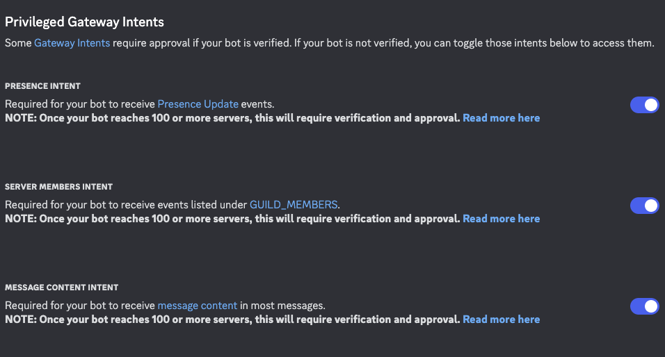

<p align="center">
  
</p>

# Job Tracker Bot (Gnome Jober)

A Discord bot that keeps track of jobs and allows users to apply for them. Adding them to google sheets.

## Discord Dashboard Setup

Make sure to have these 3 options enabled for bot to work properly:



## Google Cloud Setup

Follow the quick start guide to learn how to set up Google Cloud: https://developers.google.com/workspace/sheets/api/quickstart/nodejs

Also, to enable Google Sheet for your personal Gmail account, make sure to add your email to the test user account whitelist.
This can be found under Google Auth Platform in the Audience section. Look for a button called "Add users", then add your Gmail address to
the list.

Follow this guide if you want more details: https://developers.google.com/identity/protocols/oauth2/production-readiness/brand-verification?hl=en#projects-used-in-dev-test-stage

## Usage

1. Install dependencies: `pnpm install`
2. Run the bot: `pnpm start` or `pnpm run dev`

## Environment Variables

```txt
BOT_TOKEN="ENTER TOKEN"
GOOGLE_API_KEY="ENTER KEY"
GOOGLE_CREDENTIALS_JSON="JSON_DATA_HERE"
GOOGLE_TOKEN_JSON="JSON_DATA_HERE"
SHEET_ID="ENTER ID"
SHEET_HEADER_RANGE="Sheet1!A1:E1"
SHEET_RANGE_TEMPLATE="Sheet1!A#:E#" # Use `#`` as a placeholder for row numbers

```

## License

MIT
